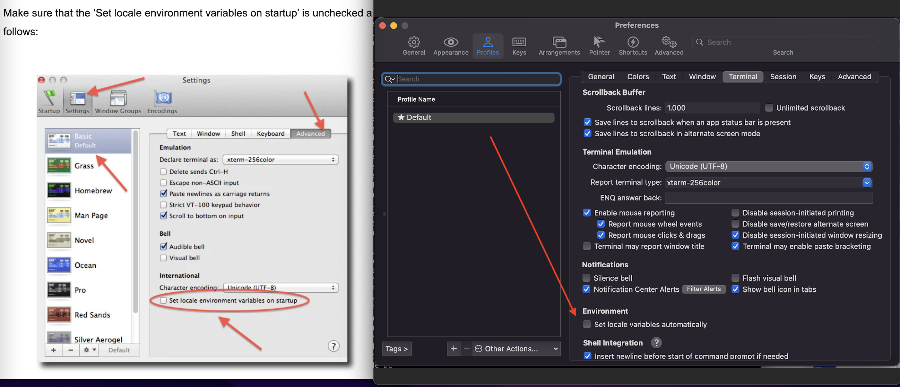

### Mi Configuración de NeoVIM

Recomendación: Curso VIM profesional
[Link Curso VIM Profesional](https://www.udemy.com/course/vim-profesional/)


### Se debe instalar neovim

### Todo el contenido equivalente al .vimrc de VIM en NeoVIm se encuentra en el siguiente path:

```
mkdir ~/.config/nvim/
```
```
touch ~/.config/nvim/init.vim
```
```
vim ~/.config/nvim/init.vim
```
### [OPCIONAL] Puedo modificar el archivo de la ruta para que tome el .vimrc por defecto

```
vim ~/.config/nvim/init.vim
```
o
```
nvim ~/.config/nvim/init.vim
```

y escribir dentro del archivo 
```
set runtimepath^=~/.vim runtimepath+=~/.vim/after
let &packpath=&runtimepath
source ~/.vimrc
```

### Debemos instalar nodeJS idealmente con la versión 12+
en caso de querer instalar distintas versiones de node se puede usar nvm (node version manager)
[Link de web NVM Node Version Manager](https://www.hostinger.es/tutoriales/instalar-node-js-ubuntu/)

```
sudo npm install -g prettier
```


### [Obligación] Instalaciones a considerar 

```git clone https://github.com/vim-airline/vim-airline ~/.vim/pack/dist/start/vim-airline```

```git clone https://github.com/vim-airline/vim-airline-themes ~/.vim/pack/dist/start/vim-airline-themes```

### Instalar Plug Para VIM NVIM
```
sh -c 'curl -fLo "${XDG_DATA_HOME:-$HOME/.local/share}"/nvim/site/autoload/plug.vim --create-dirs https://raw.githubusercontent.com/junegunn/vim-plug/master/plug.vim'
```
### Para que funcione el grep de busqueda de palabras de telescope
```
brew install ripgrep
```
```
sudo apt-get -y install ripgrep
```
### Para que funcine FZF sin problemas
```
brew install fzf
```
```
sudo apt install fzf
```
### En Mac instalar ctags
```
brew install ctags
```
### En ubuntu
```
sudo apt-get install ctags
```
### SOLO EN MAC En el mismo archivo .zshrc se coloca el alias
```
alias ctags="`brew --prefix`/bin/ctags"
```
### OPCIONAL ACK (Deprecado, ya no lo uso en esta version, pero el codigo esta comendato en el archivo de configuracion, lo dejo solo en caso de querer activarlo)
```brew install ack```
```sudo apt install ack```

### Dentro de nvim se ejecuta el siguiente comando


Presionar tecla Escape, luego : y escribir PlugInstall
quedando de la siguinete forma

```
:PlugInstall
```


### Para instalar los plugins de Coc, el mismo paso anterior colocando lo siguiente
```
:CocInstall coc-json coc-emmet coc-html coc-vue coc-vetur coc-phpls coc-prettier coc-docker coc-sql coc-tsserver coc-sh coc-css coc-pyright coc-java coc-jedi coc-marketplace coc-tslint-plugin coc-highlight coc-markdownlint coc-graphql coc-sh coc-stylelint coc-snippets
```

### En mac necesitamos instalar python la versión 3 


### Solo para Mac se instala python3 desde brew lo mism nvim y para que no tenga problemas con reconocer python3 se usan los siguientes comandos
```pip3 uninstall neovim```

```pip3 uninstall pynvim```

```pip3 install pynvim```

### Configuracion de colores para la terminal y Locale

Se configura el .zshrc con

```
export TERM=xterm-256color
export LC_CTYPE=en_US.UTF-8
export LC_ALL=en_US.UTF-8
export LANG=en_US.UTF-8
```

### En Mac puede dar errores con la Terminal o ITerm2 debido al Locale, esta es la solución 

[Link de Fuente](https://www.cyberciti.biz/faq/os-x-terminal-bash-warning-setlocale-lc_ctype-cannot-change-locale/)




